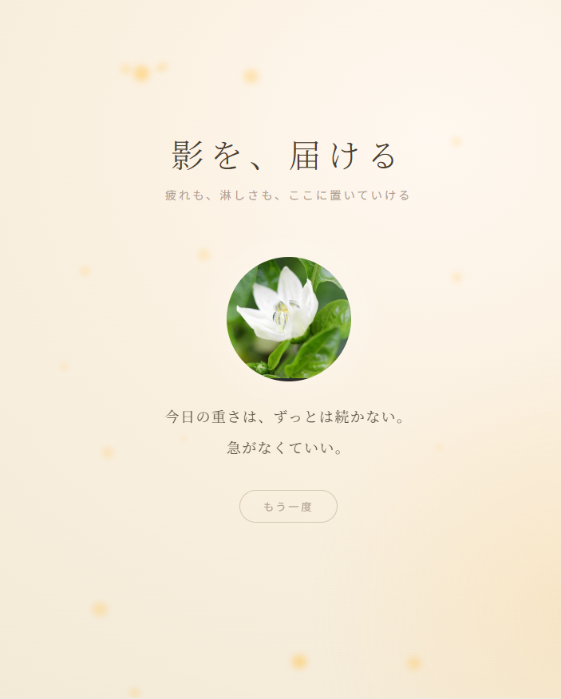
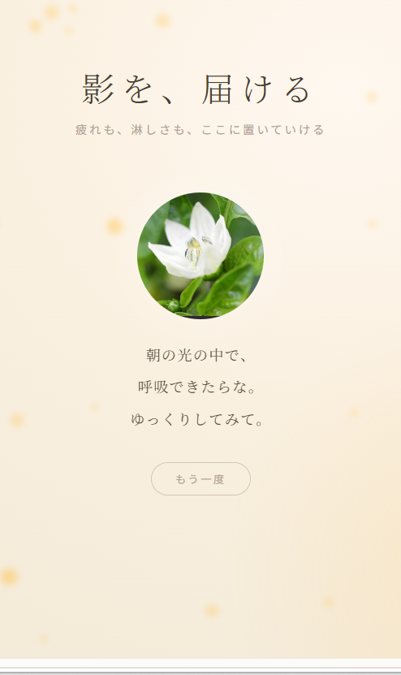
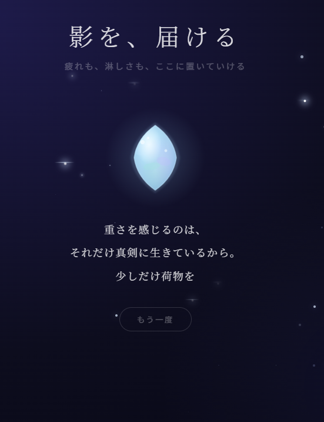
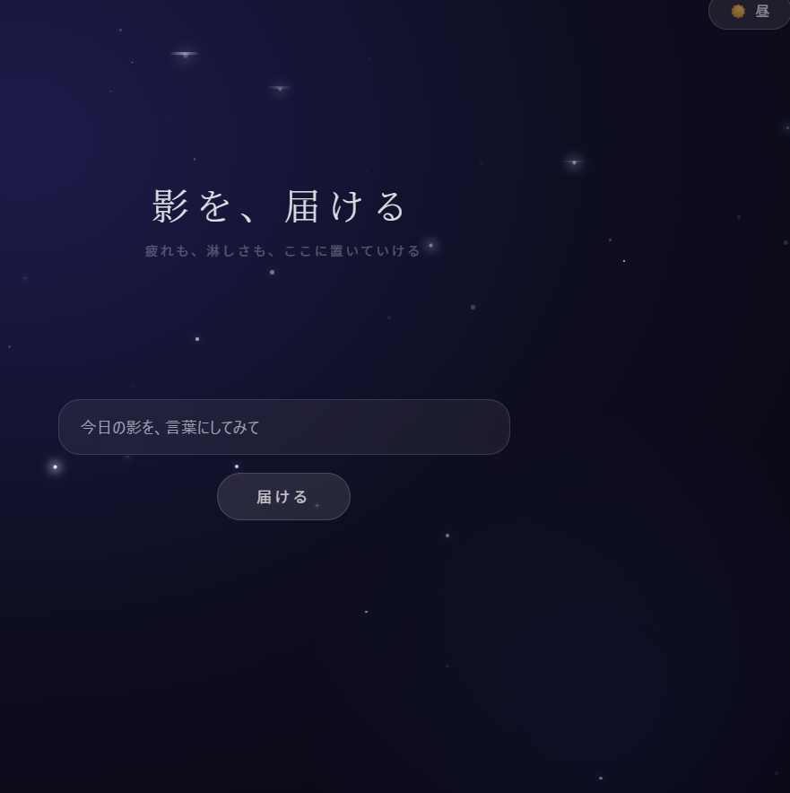
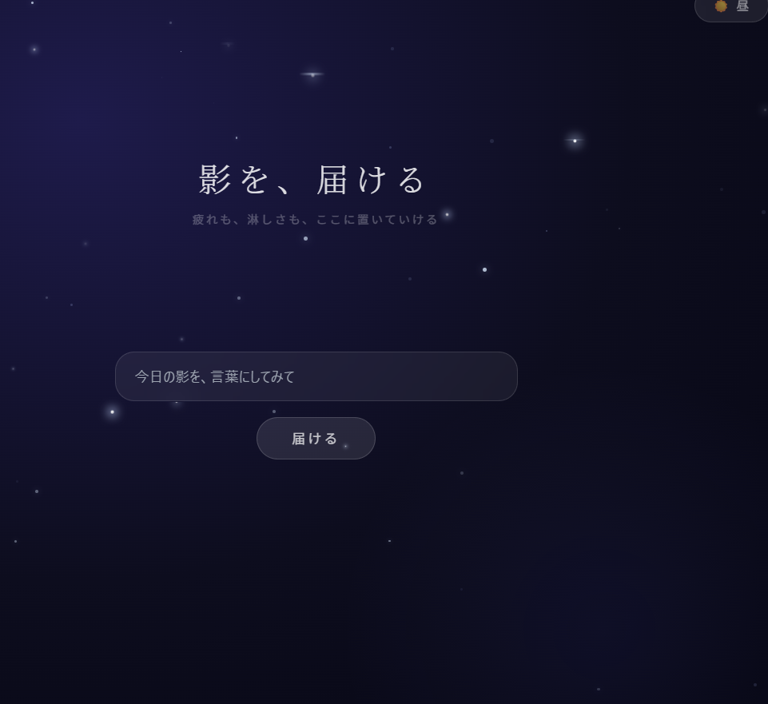
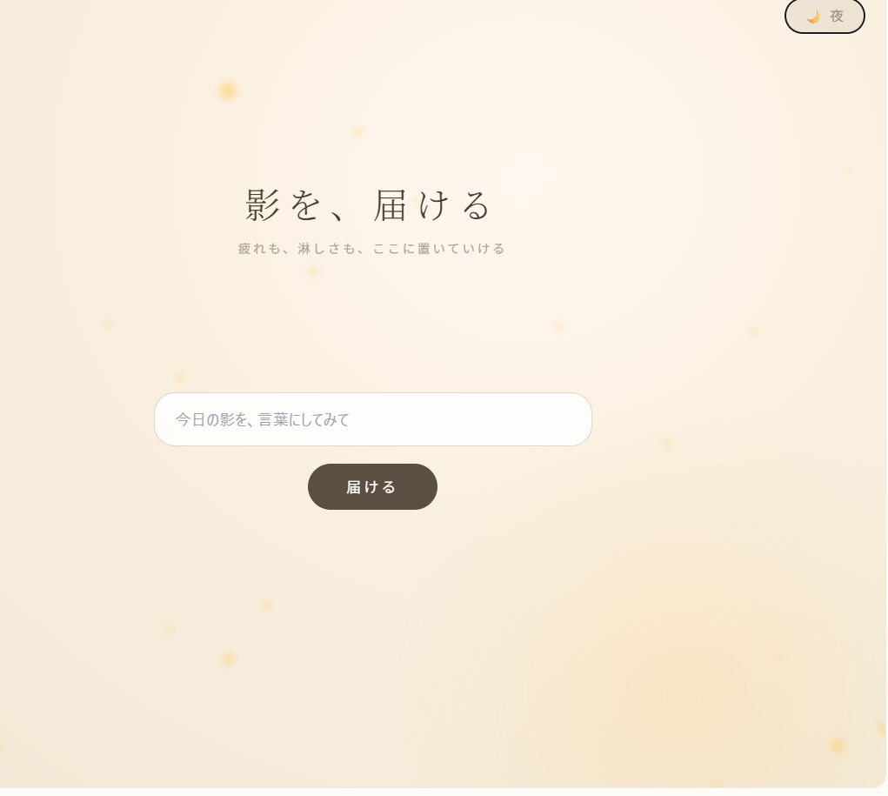

🌃影を、届ける

 自分の影を言葉にして届けたら数秒待っててください。一言だけ返ってくる場所。
夜モデル　または　昼モデル
画面右上のボタンで選択してください

このアプリについて

誰にも見せない。保存もしない。

ただ、自分の中にある影を、言葉にする。

それだけの影を抱きしめるために作られたアプリです。

---

🌃 体験する

👉 [https://shadow-1991.lovable.app](https://shadow-1991.lovable.app)

---

 💎使い方

言葉を入れる。  
影が、少し軽くなる。 短いメッセージが返ってくる。
それだけ。

---

技術

- Vite + React + TypeScript
- shadcn/ui
- Lovable

---

  誰にも見せない。保存もしない。ただ、ここだけの言葉。

